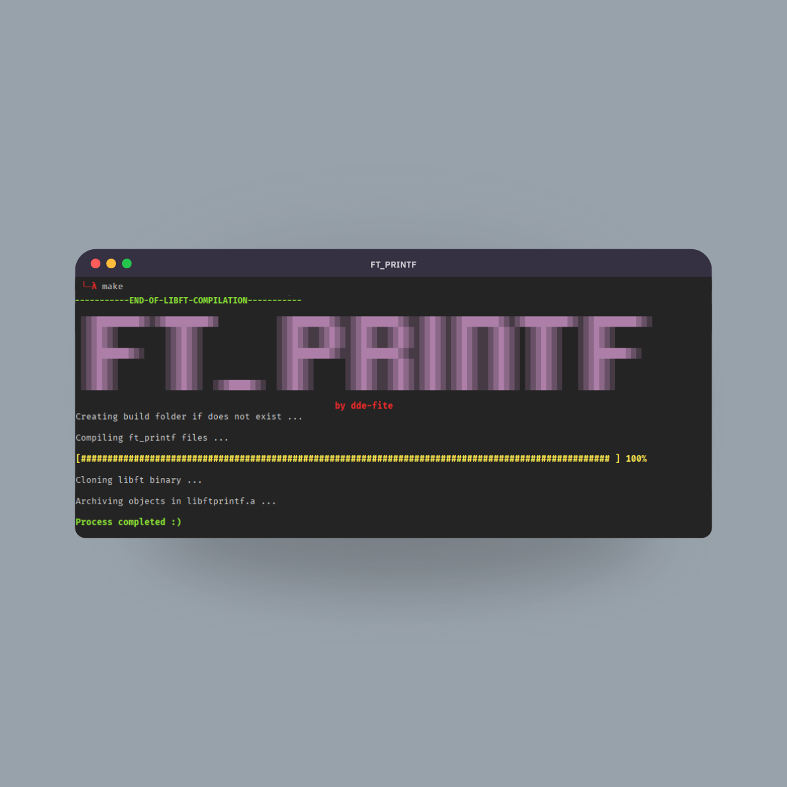

<p align="center">
	
	<h1 align="center">42_ft_printf</h1>
</p>

<div align="center">
	
</div>

## Requirements
The functions and Makefile are designed for use in a UNIX-like environment; any use outside this scope does not guarantee correct or efficient operation.
- Make
- GCC

## Usage

### Compiling
- Clone the repository recursively to download the submodules.
``` bash
git clone --recursive https://github.com/dde-fite/42_ft_printf.git
```

- For the general section
``` bash
make
```

- For the bonus section.
``` bash
make bonus
```

### Using it as a static library
After installation is complete, the libft.a file will appear. This static library can be used in any project.s

You can include the library by including libft.h and libft.a as in the example:

- First include the header file in your C or header files.
``` h
#include "ft_printf.h"
```

- Then compile using the library
``` bash
gcc main.c libftprintf.a
```

## Got any suggestions?
If you find any errors or have any new ideas for improving this repository, feel free to open an Issue or Pull Request, or contact me at my email address: nora@defitero.com